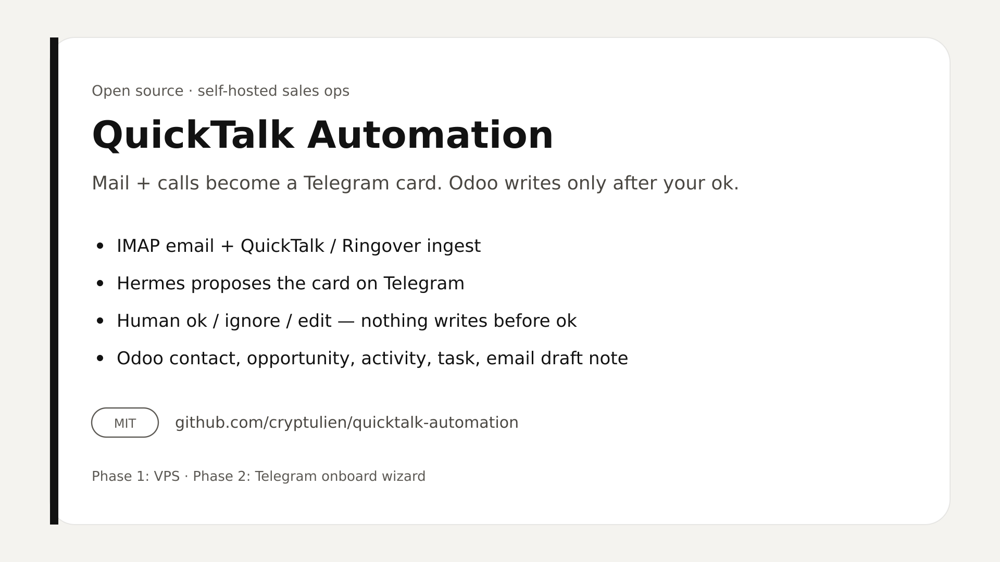
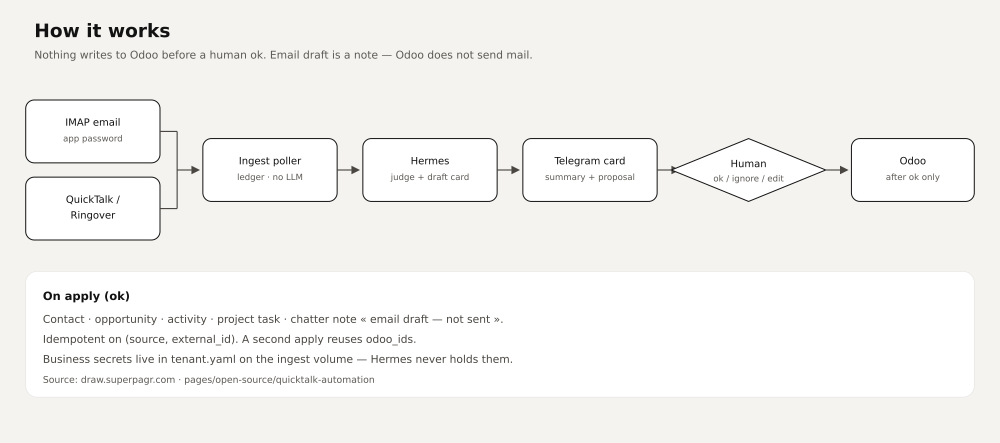

# QuickTalk Automation

[](./LICENSE)



**Open-source** plug-and-play sales-ops appliance: Hermes reads **email** and **QuickTalk / Ringover** calls, proposes a card in **Telegram**, and on your `ok` updates **Odoo** (contact, opportunity, activity, task, email draft note).

Nothing writes to Odoo before your `ok`. The email draft is a **note** on the lead — Odoo does not send mail by itself.

See [CONTRIBUTING.md](./CONTRIBUTING.md) and [SECURITY.md](./SECURITY.md).

> Formerly a paid kit. Now MIT — clone and self-host.

## How it works



IMAP + QuickTalk/Ringover → ingest poller (no LLM) → Hermes drafts a Telegram card → human `ok` / `ignore` / edit → Odoo.

Diagram source: [draw.superpagr.com](https://draw.superpagr.com) · `pages/open-source/quicktalk-automation`.

## Setup (two frozen phases)

**Phase 1 — VPS.** Give this repo to an AI (it reads `FOR-AI.md` then `pack/deploy/SKILL.md`): Docker, clone, BotFather token, **one** LLM key, `./install.sh`. No Odoo / Ringover / IMAP here.

**Phase 2 — Telegram.** You message the bot. The wizard (`GET/POST /onboard`) asks one question at a time, probes, and writes `tenant.yaml` only at the end. The bot is not allowed to invent the order.

```bash
curl -fsSL https://get.docker.com | sh
git clone https://github.com/cryptulien/quicktalk-automation.git /opt/quicktalk-automation
cd /opt/quicktalk-automation
./install.sh    # interactive: Telegram token, then one LLM key
```

## What the operator sees

```
Call · Marie Dupont · +33612345678
Yesterday 16:42 · 0:00 · inbound

Summary
Called back about the kitchen quote, available Thursday morning.

Proposal
• Lead “Kitchen quote — Dupont” (new)
• Call activity 2026-08-14 → you
• Task “Follow up quote”
• Email draft “Following your call”

Reply ok / ignore / or specify the change.
id: ringover:call:42
```

`ok` · `ignore` · `activity Friday` · `no mail`.

## Secrets

| Where | What |
|---|---|
| `.env` | Telegram token, LLM key, `SECRETARY_TOKEN` |
| ingest volume `/data/tenant.yaml` | Odoo, Ringover, IMAP — written by the bot |

Ringover key: dashboard → Developer → API key. Enable **Empower** if you want transcripts.

Gmail IMAP: app password, not the account password.

## Operations

```bash
docker compose logs -f ingest hermes
docker compose exec ingest sales-secretary status
docker compose exec ingest sales-secretary poll
curl -s http://127.0.0.1:8080/healthz   # only if you publish the port
```

The ingest API is **not** published by default. Hermes reaches it on the Docker network (`http://ingest:8080`).

## Dev

```bash
python3 -m pip install -e ".[dev]"
python3 -m pytest
docker compose config -q
```

Spec: [`docs/SPEC.md`](docs/SPEC.md).
